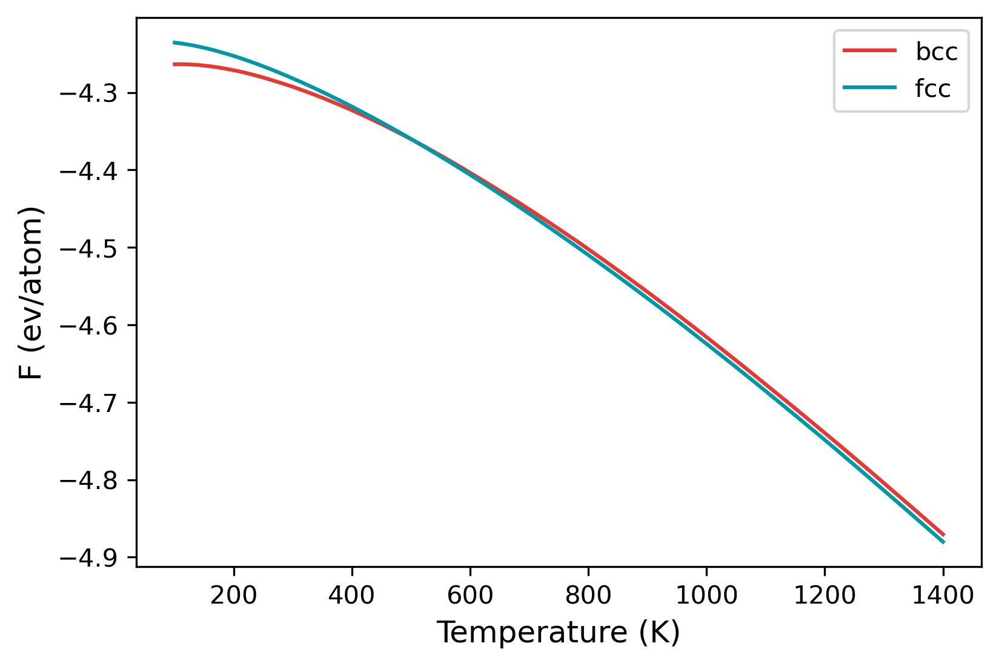

# Example 01: Phase transformation in Fe

In this example, we will make use of the temperature sweep algorithm in `calphy` to calculate the transformation temperature for BCC to FCC transition in Fe.

The EAM potential that will be used: [Meyer, R, and P Entel. “Martensite-austenite transition and phonon dispersion curves of Fe1−xNix studied by molecular-dynamics simulations.” Phys. Rev. B 57, 5140.](https://doi.org/10.1103/PhysRevB.57.5140)

The reference data is from: [Freitas, Rodrigo, Mark Asta, and Maurice de Koning. “Nonequilibrium Free-Energy Calculation of Solids Using LAMMPS.” Computational Materials Science 112 (February 2016): 333–41.](https://doi.org/10.1016/j.commatsci.2015.10.050)

The [input file](input.yaml) is provided in the folder. The calculation can be started from the terminal using:

```
calphy -i input.yaml
```

In the input file, the `calculations` block is as shown below:

```
- mode: ts
  temperature: [100, 1400]
  pressure: [0]
  lattice: [BCC]
  repeat: [5, 5, 5]
  state: [solid]
  nsims: 1
- mode: ts
  temperature: [100, 1400]
  pressure: [0]
  lattice: [FCC]
  repeat: [5, 5, 5]
  state: [solid]
  nsims: 1
  lattice_constant: [6.00]
```

The mode is listed as `ts`, which stands for temperature sweep. The sweep starts from the first value in the `temperature` option, which is 100 K. The free energy is integrated until 1400 K, which is the second value listed. Furthermore, there are also two calculation blocks. You can see that the `lattice` mentioned is different; one set is for BCC structure, while the other is FCC.

Once the calculation is over, there will a file called `temperature_sweep.dat` in each of the folders. This file indicates the variation of free energy with the temperature. We can read in the files and calculate the transition temperature as follows:

```
import numpy as np

bt, bfe, bferr = np.loadtxt("ts-BCC-100-0/temperature_sweep.dat", unpack=True)
ft, ffe, fferr = np.loadtxt("ts-FCC-100-0/temperature_sweep.dat", unpack=True)

args = np.argsort(np.abs(bfe-ffe))
print(bt[args[0]], "K")

plt.plot(bt, bfe, color="#E53935", label="bcc")
plt.plot(ft, ffe, color="#0097A7", label="fcc")
plt.xlabel("Temperature (K)", fontsize=12)
plt.ylabel("F (ev/atom)", fontsize=12)
plt.legend()
```


A jupyter notebook that calculates the transition temperature is shown [here](analysis.ipynb).